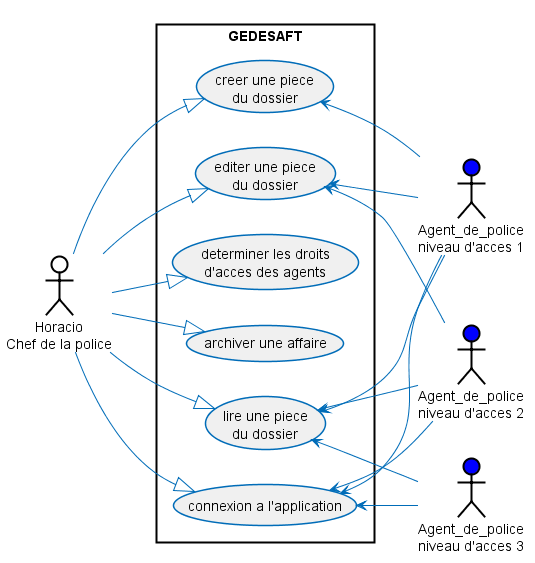
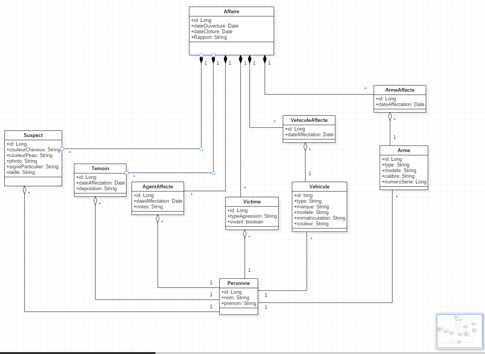

# PROJET FIL ROUGE

## Maquetter une application

### Faire un diagramme USE CASE
  
		
### Faire un diagramme d'activité
[authentification](https://github.com/rudylps/diagrammes_gedesaft_v2/blob/master/diagrammeActivite_autentification.pdf)  
[creation Arme](https://github.com/rudylps/diagrammes_gedesaft_v2/blob/master/diagrammeActivite_creationArme.pdf)  
[creation Protagoniste](https://github.com/rudylps/diagrammes_gedesaft_v2/blob/master/diagrammeActivite_creationProtagoniste.pdf)  
[creation Vehicule](https://github.com/rudylps/diagrammes_gedesaft_v2/blob/master/diagrammeActivite_creationVehicule.pdf)  
[gérer les accès](https://github.com/rudylps/diagrammes_gedesaft_v2/blob/master/diagrammeActivite_gestionAcces.pdf)  
[rechercher une arme](https://github.com/rudylps/diagrammes_gedesaft_v2/blob/master/diagrammeActivite_rechercheArme.pdf)  
[rechercher un véhicule](https://github.com/rudylps/diagrammes_gedesaft_v2/blob/master/diagrammeActivite_rechercheVehicule.pdf)  

### Faire un diagramme des classes

        
        
### Identifier les acteurs d'un SI
Dans cette application, les acteurs sont :  
Le chef de service  
Un agent affecté à une affaire
Un agent  
Le personnel judiciaire

        
### Dessiner des wireframe ou mockup (écrans)
[Mockups](https://github.com/rudylps/diagrammes_gedesaft_v2/blob/master/mockUp.bmpr)
Le lien amène à un fichier à télécharger en cliquant sur View Raw. Le fichier mockUp.bmpr s'ouvre avec le logiciel Balsamiq  
[télécharger Balsamiq](https://balsamiq.com/)
        
### Modéliser l'enchainement des écrans
L'enchainement des écrans peut se faire dans le mockUp en suivant la procédure :  
Lancer balsamiq  
Ouvrir le fichier précédemment téléchargé  
Lancer le mode plein écran ou taper CTRL+F
        
        
## Concevoir une base de données

### Epliquer le terme SGBDR
Système de Gestion de Base de Données Relationnelle  
Stocke les données de manière organisée et cohérente
        
        
### Utiliser un outil graphique pour créer une base de données
Pour générer la base de données nous avons utilisé le logiciel [MySQLWorkBench](https://www.mysql.com/fr/products/workbench/)
        
        
### Créer/Modifier une table avec ses champs
### Matérialiser une relation entre tables
### Je sais écrire une requête de création de table        
### Je sais définir une clé primaire sur une table
	CREATE TABLE IF NOT EXISTS `gedesaft`.`affaires` (  
  	`id` INT(11) NOT NULL AUTO_INCREMENT,  
  	`dossier` VARCHAR(45) NULL DEFAULT NULL,  
  	`lieu` VARCHAR(45) NULL DEFAULT NULL,  
  	`dateOuverture` DATE NULL DEFAULT NULL,  
  	PRIMARY KEY (`id`),  
  	UNIQUE INDEX `id_UNIQUE` (`id` ASC));  

        
### Je sais définir une clé étrangère sur une table        
### Je sais définir une contrainte sur une colonne donnée
	CREATE TABLE IF NOT EXISTS `gedesaft`.`agentaffecte` (
  	`id` INT(11) NOT NULL AUTO_INCREMENT,
  	`dateAffectation` VARCHAR(45) NULL DEFAULT NULL,
  	`affaires_id` INT(11) NOT NULL,
  	`agents_id` INT(11) NOT NULL,
  	PRIMARY KEY (`id`),
  	UNIQUE INDEX `id_UNIQUE` (`id` ASC),
  	INDEX `fk_AgentAffecte_affaires1_idx` (`affaires_id` ASC),
  	INDEX `fk_AgentAffecte_agents1_idx` (`agents_id` ASC),
  	CONSTRAINT `fk_AgentAffecte_affaires1`
    	FOREIGN KEY (`affaires_id`)
    	REFERENCES `gedesaft`.`affaires` (`id`)
    	ON DELETE NO ACTION
    	ON UPDATE NO ACTION,
  	CONSTRAINT `fk_AgentAffecte_agents1`
    	FOREIGN KEY (`agents_id`)
    	REFERENCES `gedesaft`.`agents` (`id`)
    	ON DELETE NO ACTION
    	ON UPDATE NO ACTION);  

        
## Mettre en place une base de données

### Installer un SGBDR
Lancer MySQL Workbench.  
Ouvrir le fichier [gedesaft2BIS.mwb](gedesaft2BIS.mwb)  
File -> Export -> Forward Engineer ... -> Next -> Next -> Finish  
        
        
### Créer des rôles et une base
        
        
        ### Exécuter un script de création de tables / données (fichier.sql)
        
        
        ### Ecrire une requête pour insérer des données dans une table
        
        
        ### Exporter une structure de tables (données comprises) et la réintégrer dans une autre base de données
        
        
## Développer une interface utilisateur

        ### Réaliser une interface graphique
        
        
        ### Appliquer une charte graphique
        
        
        ### Analyser une maquette graphique et identifier les différentes parties d'un écran (zoning)
        
        
        ### Faire un menu
        
        
        ### Enchainer les écrans
        
        
        ### Connaitre des composants graphiques qui permettent de créer un écran
        
        
        ### Faire un formulaire de saisie
        
        
        ### Mettre en place des procédures de contrôle de saisie
        
        
        ### Faire un test unitaire manuel
        
        ### Coder avec un langae orienté objet
        
        ### Connaître la programmation événementielle
        
        ### Connaitre la programmation déclrative
        
        ### Utiliser un Environnement de Développement intégré (IDE)
        
        ### Versionner mon travail
        
        ### Mettre des commentaires dans mes programmes
        
        ### Coder selon les règles de l'art
        
        ### Produire un livrable
# GEDESAFT

Afin de pourvoir installer et lancer l'application, il faut savoir utiliser les lignes de commandes
https://windows.developpez.com/cours/ligne-commande/

## CONFIGURATION REQUISE

- JRE installer sur l'ordinateur (v 1.8), attention la v 1.9 est déconseillée
https://www.java.com/fr/download/help/download_options.xml
- MySql-server (v 5.7 +)
https://dev.mysql.com/downloads/mysql/#downloads
https://openclassrooms.com/courses/administrez-vos-bases-de-donnees-avec-mysql/installation-de-mysql (tuto installation)
- git (v2.14 +) 
https://git-scm.com/book/fr/v1/D%C3%A9marrage-rapide-Installation-de-Git
- Node.js 
https://openclassrooms.com/courses/des-applications-ultra-rapides-avec-node-js/installer-node-js (tuto installation)
https://nodejs.org/en/download/ (téléchargement)
- Angular CLI (v1.6.5 +)
lancer la ligne de commande "npm install @angular/cli" (nécéssite node.js)

## IMPORT DU PROJET

Installer les prérequis si nécéssaire
Télécharger le dossier .zip du projet 
ou l'importer (voir ci dessous)
 - Lancer le gitBash à l'emplacement ou vous voulez importez le projet (click Droit "Git Bash Here")
 - Lancer la commande "git clone https://github.com/DethierY/GEDESAFT.git"
 
## CONFIGURATION TECHNIQUE

Allez dans le dossier **resources** (GEDESAFT\src\main\resources) : 

Dedans se trouve fichier **application.properties**, il faut indiquer les informations de connection a votre base de données (url, et identiffiants admins) 

Lancer le server sql, 
importer la base de données (avec le fichier gedesaft.sql présent dans le dossier des diagrammes https://github.com/rudylps/diagrammes_gedesaft_v2.git)

## LANCEMENT DE L'APPLICATION

L'application étant séparée en deux parties, il faut les démarrer toutes les deux pour que l'application fonctionne

### Lancer l'application Springboot
Cloner ou télécharger le dossier back-end https://github.com/DethierY/GEDESAFT.git
  
    Créer un .jar : 
    
      Ouvrez une invite de commande dans le dossier "gedesaft" et lancez les lignes suivantes :
      
      - mvn package -DskipTests
      - cd target
      - java -jar java-springboot-simplecrud-0.0.1-SNAPSHOT.jar"
	  
### Lancer l'application Angular
Ce projet a été généré avec Angular CLI 1.6.5
Cloner ou télécharger le dossier front-end https://github.com/milk42/FilRougeV2Front.git

Dans le dossier du front, lancer une ligne de commande
 - npm install
 - ng serve
 
- Dans un navigateur internet, inscrire l'adresse http://localhost:4200/
	

# L'UML

Dans ce dossier vous pouvez trouver les différents diagrammes et tables qui nous ont servis pour la conception de notre application.
Les diagrammes ont été réalisé pour la première version de GEDESAFT et peuvent ne plus correspondre exactement à l'actuelle application.

## Les mockups

- Pour lire le fichier **mockUp.bmpr**, il faut le programme Balsamiq
https://balsamiq.com/
- Ensuite, ouvrir **mockUp.bmpr**.
Faire **Ctrl + F** afin de lancer le plein écran et les fonctionnalités d'enchainement des écrans matérialisants les hyperliens
